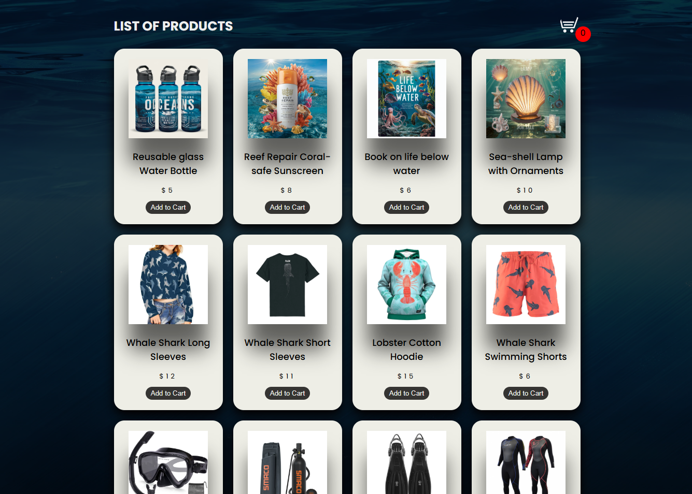
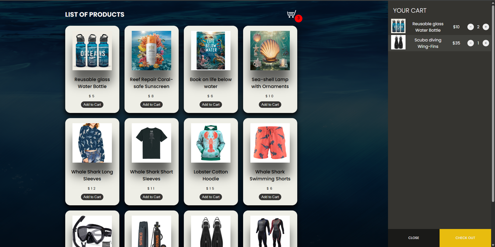
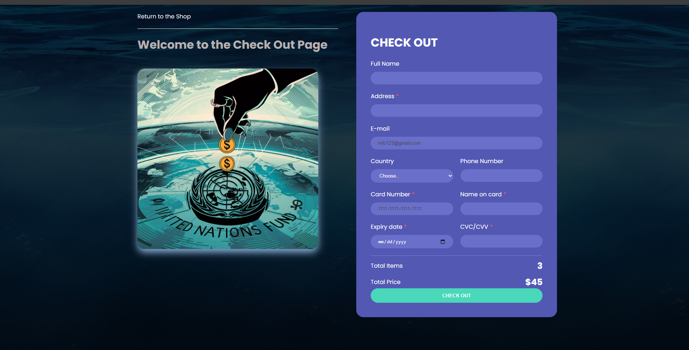

# 🌊 Ocean Conservation Shopping Cart 🛒

*An e-commerce platform supporting marine life conservation*

## 📌 Overview

A responsive shopping cart system featuring ocean-themed products, with proceeds supporting UN Sustainable Development Goal 14: Life Below Water.

## ✨ Features

<div align="center">
  
| Feature | Description | Preview |
|---------|-------------|---------|
| 🛍️ Product Catalog | 12 unique ocean-themed products |  |
| 🧮 Interactive Cart | Add/remove items, adjust quantities |  |
| 💳 Secure Checkout | Payment form with validation |  |

</div>

## 🛠️ Technologies Used

```mermaid
pie
    title Tech Stack
    "HTML5" : 35
    "CSS3" : 35
    "JavaScript" : 30
